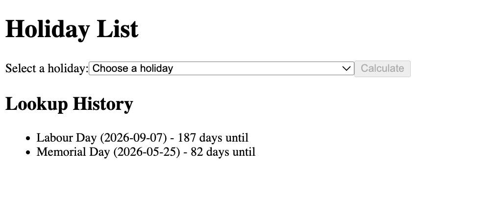

# eureka-test-project

A holiday lookup application that displays US public holidays for 2026 and tracks lookup history.

## Screenshot



## Features

- View all US public holidays for 2026
- Calculate days until a selected holiday
- Track lookup history with timestamps
- SQLite database for persistent storage

## Setup

1. Install dependencies:
   ```bash
   npm install
   ```

2. Start the backend server:
   ```bash
   npm run server
   ```

3. Start the frontend dev server:
   ```bash
   npm run dev
   ```

4. Open http://localhost:5173 in your browser